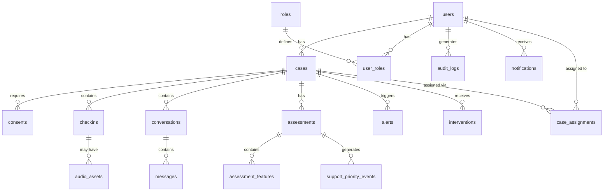

# SAHAY-AI Database Design

## Overview

PostgreSQL with Alembic migrations. All tables use UUIDs as primary keys.
Timestamps use `TIMESTAMPTZ` (timezone-aware).

## Entity Relationship Diagram



## Tables

### users

| Column           | Type         | Constraints                | Notes                          |
|------------------|--------------|----------------------------|--------------------------------|
| id               | UUID         | PK, DEFAULT gen_random_uuid() |                              |
| email            | VARCHAR(255) | UNIQUE, NOT NULL            |                                |
| phone            | VARCHAR(20)  | UNIQUE, NULLABLE            | Optional phone auth            |
| password_hash    | VARCHAR(255) | NOT NULL                    | bcrypt                         |
| full_name        | VARCHAR(255) | NOT NULL                    |                                |
| preferred_language | VARCHAR(10)| DEFAULT 'en'                | ISO 639-1                      |
| is_active        | BOOLEAN      | DEFAULT TRUE                |                                |
| is_verified      | BOOLEAN      | DEFAULT FALSE               |                                |
| last_login_at    | TIMESTAMPTZ  | NULLABLE                    |                                |
| created_at       | TIMESTAMPTZ  | DEFAULT NOW()               |                                |
| updated_at       | TIMESTAMPTZ  | DEFAULT NOW()               | Trigger-updated                |

### roles

| Column      | Type         | Constraints     | Notes                         |
|-------------|--------------|-----------------|-------------------------------|
| id          | UUID         | PK              |                               |
| name        | VARCHAR(50)  | UNIQUE, NOT NULL| victim, counsellor, district_admin, state_admin |
| description | TEXT         | NULLABLE        |                               |

### user_roles

| Column   | Type | Constraints         | Notes               |
|----------|------|---------------------|----------------------|
| user_id  | UUID | FK(users), NOT NULL  | Composite PK        |
| role_id  | UUID | FK(roles), NOT NULL  | Composite PK        |
| assigned_at | TIMESTAMPTZ | DEFAULT NOW() |                    |

### cases

| Column           | Type         | Constraints              | Notes                      |
|------------------|--------------|--------------------------|----------------------------|
| id               | UUID         | PK                       |                            |
| case_number      | VARCHAR(20)  | UNIQUE, NOT NULL         | Generated: CASE-NNNNNN     |
| victim_id        | UUID         | FK(users), NOT NULL      |                            |
| status           | VARCHAR(20)  | NOT NULL, DEFAULT 'active'| active, monitoring, closed, archived |
| district         | VARCHAR(100) | NULLABLE                 |                            |
| state            | VARCHAR(100) | NULLABLE                 |                            |
| created_at       | TIMESTAMPTZ  | DEFAULT NOW()            |                            |
| updated_at       | TIMESTAMPTZ  | DEFAULT NOW()            |                            |
| closed_at        | TIMESTAMPTZ  | NULLABLE                 |                            |

### case_assignments

| Column        | Type         | Constraints              | Notes                    |
|---------------|--------------|--------------------------|--------------------------|
| id            | UUID         | PK                       |                          |
| case_id       | UUID         | FK(cases), NOT NULL      |                          |
| counsellor_id | UUID         | FK(users), NOT NULL      |                          |
| assigned_at   | TIMESTAMPTZ  | DEFAULT NOW()            |                          |
| unassigned_at | TIMESTAMPTZ  | NULLABLE                 |                          |
| is_primary    | BOOLEAN      | DEFAULT FALSE            |                          |

### consents

| Column          | Type         | Constraints              | Notes                    |
|-----------------|--------------|--------------------------|--------------------------|
| id              | UUID         | PK                       |                          |
| case_id         | UUID         | FK(cases), NOT NULL      |                          |
| consent_type    | VARCHAR(50)  | NOT NULL                 | data_collection, voice_recording, ai_analysis |
| granted         | BOOLEAN      | NOT NULL                 |                          |
| granted_at      | TIMESTAMPTZ  | NULLABLE                 |                          |
| revoked_at      | TIMESTAMPTZ  | NULLABLE                 |                          |
| ip_address      | VARCHAR(45)  | NULLABLE                 | For audit                |
| consent_version | VARCHAR(10)  | NOT NULL                 | Schema version           |

### checkins

| Column           | Type         | Constraints              | Notes                    |
|------------------|--------------|--------------------------|--------------------------|
| id               | UUID         | PK                       |                          |
| case_id          | UUID         | FK(cases), NOT NULL      |                          |
| checkin_type     | VARCHAR(20)  | NOT NULL                 | scheduled, on_demand, follow_up |
| responses        | JSONB        | NOT NULL                 | Structured check-in answers |
| mood_rating      | INTEGER      | CHECK(1-5), NULLABLE     | Self-reported 1-5        |
| distress_level   | INTEGER      | CHECK(1-10), NULLABLE    | Self-reported 1-10       |
| notes            | TEXT         | NULLABLE                 | Free text (encrypted future) |
| idempotency_key  | VARCHAR(64)  | UNIQUE, NOT NULL         | Prevent duplicates       |
| submitted_at     | TIMESTAMPTZ  | DEFAULT NOW()            |                          |
| created_at       | TIMESTAMPTZ  | DEFAULT NOW()            |                          |

### conversations

| Column        | Type         | Constraints              | Notes                    |
|---------------|--------------|--------------------------|--------------------------|
| id            | UUID         | PK                       |                          |
| case_id       | UUID         | FK(cases), NOT NULL      |                          |
| started_at    | TIMESTAMPTZ  | DEFAULT NOW()            |                          |
| ended_at      | TIMESTAMPTZ  | NULLABLE                 |                          |
| conversation_type | VARCHAR(20) | NOT NULL              | checkin_chat, support_chat, counsellor_chat |
| status        | VARCHAR(20)  | DEFAULT 'active'         |                          |

### messages

| Column          | Type         | Constraints              | Notes                    |
|-----------------|--------------|--------------------------|--------------------------|
| id              | UUID         | PK                       |                          |
| conversation_id | UUID         | FK(conversations), NOT NULL |                       |
| sender_type     | VARCHAR(20)  | NOT NULL                 | user, ai, counsellor, system |
| content         | TEXT         | NOT NULL                 |                          |
| message_type    | VARCHAR(20)  | DEFAULT 'text'           | text, voice_transcript, system |
| metadata        | JSONB        | NULLABLE                 | AI confidence, language, etc. |
| created_at      | TIMESTAMPTZ  | DEFAULT NOW()            |                          |

### audio_assets

| Column          | Type         | Constraints              | Notes                    |
|-----------------|--------------|--------------------------|--------------------------|
| id              | UUID         | PK                       |                          |
| case_id         | UUID         | FK(cases), NOT NULL      |                          |
| checkin_id      | UUID         | FK(checkins), NULLABLE   |                          |
| storage_path    | VARCHAR(500) | NOT NULL                 | Object storage path      |
| duration_seconds| FLOAT        | NULLABLE                 |                          |
| format          | VARCHAR(20)  | NOT NULL                 | wav, mp3, webm           |
| transcript      | TEXT         | NULLABLE                 | ASR result               |
| analysis_status | VARCHAR(20)  | DEFAULT 'pending'        | pending, processing, completed, failed |
| consent_verified| BOOLEAN      | DEFAULT FALSE            |                          |
| retention_until | TIMESTAMPTZ  | NOT NULL                 | Auto-delete date         |
| created_at      | TIMESTAMPTZ  | DEFAULT NOW()            |                          |

### assessments

| Column              | Type         | Constraints              | Notes                |
|---------------------|--------------|--------------------------|----------------------|
| id                  | UUID         | PK                       |                      |
| case_id             | UUID         | FK(cases), NOT NULL      |                      |
| checkin_id          | UUID         | FK(checkins), NULLABLE   | Triggering check-in  |
| assessment_type     | VARCHAR(30)  | NOT NULL                 | automated, manual, hybrid |
| priority            | VARCHAR(20)  | NOT NULL                 | LOW, MODERATE, HIGH, URGENT |
| score               | INTEGER      | CHECK(0-100)             |                      |
| confidence          | FLOAT        | CHECK(0-1)               |                      |
| trend               | VARCHAR(20)  | NOT NULL                 | STABLE, INCREASING, DECREASING, INSUFFICIENT_DATA |
| reasons             | JSONB        | NOT NULL                 | Array of reason strings |
| requires_human_review | BOOLEAN    | DEFAULT TRUE             |                      |
| ai_provider         | VARCHAR(50)  | NOT NULL                 | mock, ollama, gemini, huggingface |
| ai_model            | VARCHAR(100) | NULLABLE                 |                      |
| reviewed_by         | UUID         | FK(users), NULLABLE      |                      |
| reviewed_at         | TIMESTAMPTZ  | NULLABLE                 |                      |
| created_at          | TIMESTAMPTZ  | DEFAULT NOW()            |                      |

### assessment_features

| Column        | Type         | Constraints              | Notes                    |
|---------------|--------------|--------------------------|--------------------------|
| id            | UUID         | PK                       |                          |
| assessment_id | UUID         | FK(assessments), NOT NULL|                          |
| feature_name  | VARCHAR(100) | NOT NULL                 | e.g., "self_reported_distress" |
| feature_value | FLOAT        | NOT NULL                 | Normalized 0-1           |
| source        | VARCHAR(50)  | NOT NULL                 | checkin, text_analysis, voice_analysis, behaviour |
| evidence      | TEXT         | NULLABLE                 | Supporting text/data     |
| created_at    | TIMESTAMPTZ  | DEFAULT NOW()            |                          |

### support_priority_events

| Column        | Type         | Constraints              | Notes                    |
|---------------|--------------|--------------------------|--------------------------|
| id            | UUID         | PK                       |                          |
| case_id       | UUID         | FK(cases), NOT NULL      |                          |
| assessment_id | UUID         | FK(assessments), NOT NULL|                          |
| priority      | VARCHAR(20)  | NOT NULL                 |                          |
| score         | INTEGER      | NOT NULL                 |                          |
| trend         | VARCHAR(20)  | NOT NULL                 |                          |
| snapshot      | JSONB        | NOT NULL                 | Full priority snapshot   |
| created_at    | TIMESTAMPTZ  | DEFAULT NOW()            |                          |

**Index:** `(case_id, created_at DESC)` for trend queries.

### alerts

| Column           | Type         | Constraints              | Notes                    |
|------------------|--------------|--------------------------|--------------------------|
| id               | UUID         | PK                       |                          |
| case_id          | UUID         | FK(cases), NOT NULL      |                          |
| assessment_id    | UUID         | FK(assessments), NULLABLE|                          |
| alert_type       | VARCHAR(30)  | NOT NULL                 | priority_change, safety_cue, missed_checkin, trend_alert |
| severity         | VARCHAR(20)  | NOT NULL                 | INFO, WARNING, CRITICAL  |
| title            | VARCHAR(255) | NOT NULL                 |                          |
| description      | TEXT         | NOT NULL                 |                          |
| status           | VARCHAR(20)  | DEFAULT 'pending'        | pending, acknowledged, assigned, resolved, dismissed |
| acknowledged_by  | UUID         | FK(users), NULLABLE      |                          |
| acknowledged_at  | TIMESTAMPTZ  | NULLABLE                 |                          |
| assigned_to      | UUID         | FK(users), NULLABLE      |                          |
| created_at       | TIMESTAMPTZ  | DEFAULT NOW()            |                          |
| updated_at       | TIMESTAMPTZ  | DEFAULT NOW()            |                          |

### interventions

| Column          | Type         | Constraints              | Notes                    |
|-----------------|--------------|--------------------------|--------------------------|
| id              | UUID         | PK                       |                          |
| case_id         | UUID         | FK(cases), NOT NULL      |                          |
| alert_id        | UUID         | FK(alerts), NULLABLE     |                          |
| created_by      | UUID         | FK(users), NOT NULL      |                          |
| intervention_type | VARCHAR(50) | NOT NULL                | contact, follow_up, referral, counselling_session, safety_plan |
| status          | VARCHAR(20)  | DEFAULT 'planned'        | planned, in_progress, completed, cancelled |
| priority        | VARCHAR(20)  | DEFAULT 'MODERATE'       |                          |
| description     | TEXT         | NOT NULL                 |                          |
| scheduled_at    | TIMESTAMPTZ  | NULLABLE                 |                          |
| completed_at    | TIMESTAMPTZ  | NULLABLE                 |                          |
| outcome         | TEXT         | NULLABLE                 |                          |
| created_at      | TIMESTAMPTZ  | DEFAULT NOW()            |                          |
| updated_at      | TIMESTAMPTZ  | DEFAULT NOW()            |                          |

### notifications

| Column        | Type         | Constraints              | Notes                    |
|---------------|--------------|--------------------------|--------------------------|
| id            | UUID         | PK                       |                          |
| user_id       | UUID         | FK(users), NOT NULL      |                          |
| title         | VARCHAR(255) | NOT NULL                 |                          |
| body          | TEXT         | NOT NULL                 |                          |
| notification_type | VARCHAR(30) | NOT NULL              | alert, reminder, update, system |
| is_read       | BOOLEAN      | DEFAULT FALSE            |                          |
| reference_type| VARCHAR(50)  | NULLABLE                 | alert, intervention, checkin |
| reference_id  | UUID         | NULLABLE                 |                          |
| created_at    | TIMESTAMPTZ  | DEFAULT NOW()            |                          |

### service_directory

| Column        | Type         | Constraints              | Notes                    |
|---------------|--------------|--------------------------|--------------------------|
| id            | UUID         | PK                       |                          |
| name          | VARCHAR(255) | NOT NULL                 |                          |
| service_type  | VARCHAR(50)  | NOT NULL                 | helpline, shelter, legal_aid, counselling, medical |
| phone         | VARCHAR(20)  | NULLABLE                 |                          |
| address       | TEXT         | NULLABLE                 |                          |
| district      | VARCHAR(100) | NULLABLE                 |                          |
| state         | VARCHAR(100) | NULLABLE                 |                          |
| is_active     | BOOLEAN      | DEFAULT TRUE             |                          |
| operating_hours | VARCHAR(100)| NULLABLE                 |                          |
| metadata      | JSONB        | NULLABLE                 |                          |

### audit_logs

| Column        | Type         | Constraints              | Notes                    |
|---------------|--------------|--------------------------|--------------------------|
| id            | UUID         | PK                       |                          |
| user_id       | UUID         | FK(users), NULLABLE      |                          |
| action        | VARCHAR(100) | NOT NULL                 | e.g., "case.view", "alert.acknowledge" |
| resource_type | VARCHAR(50)  | NOT NULL                 |                          |
| resource_id   | UUID         | NULLABLE                 |                          |
| ip_address    | VARCHAR(45)  | NULLABLE                 |                          |
| user_agent    | VARCHAR(500) | NULLABLE                 |                          |
| request_id    | UUID         | NULLABLE                 |                          |
| details       | JSONB        | NULLABLE                 | Additional context       |
| created_at    | TIMESTAMPTZ  | DEFAULT NOW()            |                          |

**Note:** audit_logs should NOT contain raw conversation text, access tokens, or API keys.

## Indexes

```sql
-- Performance indexes
CREATE INDEX idx_cases_victim_id ON cases(victim_id);
CREATE INDEX idx_cases_status ON cases(status);
CREATE INDEX idx_checkins_case_id ON checkins(case_id, submitted_at DESC);
CREATE INDEX idx_messages_conversation_id ON messages(conversation_id, created_at);
CREATE INDEX idx_assessments_case_id ON assessments(case_id, created_at DESC);
CREATE INDEX idx_alerts_status ON alerts(status, severity);
CREATE INDEX idx_alerts_case_id ON alerts(case_id);
CREATE INDEX idx_interventions_case_id ON interventions(case_id);
CREATE INDEX idx_support_priority_trend ON support_priority_events(case_id, created_at DESC);
CREATE INDEX idx_audit_logs_user ON audit_logs(user_id, created_at DESC);
CREATE INDEX idx_notifications_user ON notifications(user_id, is_read, created_at DESC);
CREATE INDEX idx_case_assignments_counsellor ON case_assignments(counsellor_id, unassigned_at);
```

## Migration Strategy

- Use Alembic with async SQLAlchemy
- Each migration is reversible (upgrade + downgrade)
- Naming: `YYYYMMDD_HHMMSS_description.py`
- Never modify a committed migration — create a new one
