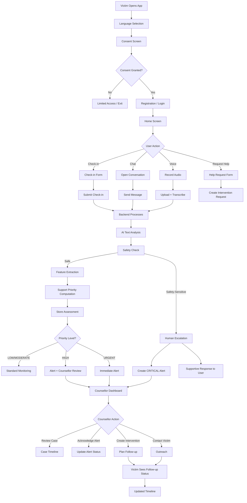

# SAHAY-AI — Workflow

## End-to-End Victim Journey (MVP)



## Check-in Flow (Detailed)

```
1. Victim opens check-in screen
2. App presents structured questions:
   - How are you feeling today? (1-5 scale)
   - How is your sleep? (1-5 scale)
   - Do you feel safe? (1-5 scale)
   - How is your daily routine? (1-5 scale)
   - Anything you'd like to share? (free text, optional)
3. Client generates idempotency_key (UUID)
4. Client submits to POST /cases/{id}/checkins
5. Server validates idempotency_key (prevents duplicates)
6. Server stores check-in
7. Server triggers async assessment:
   a. Text analysis (if free text provided)
   b. Feature extraction from structured responses
   c. Safety cue detection
   d. Support priority computation
   e. Trend calculation
   f. Alert generation (if priority change or safety cue)
8. Server returns confirmation to victim
9. Victim sees: "Check-in submitted. Thank you."
```

## Counsellor Workflow

```
1. Counsellor logs in
2. Dashboard shows:
   - Cases requiring attention count
   - Priority breakdown (URGENT/HIGH/MODERATE/LOW)
   - Recent alerts
   - Pending interventions
3. Counsellor clicks priority case
4. Case detail shows:
   - Support Priority with explanation
   - Trend visualization
   - Check-in timeline
   - Conversation summaries
   - Active alerts
   - Intervention history
5. Counsellor actions:
   - Acknowledge alert
   - Create intervention (follow-up, referral, etc.)
   - Add notes
   - Assign to another counsellor
   - Contact victim
6. All actions logged for audit
```

## Safety Escalation Flow

```
1. User sends message or check-in containing safety cue
2. Deterministic safety rules fire FIRST
3. If safety-sensitive:
   a. Flag message internally
   b. Generate calm, supportive response
   c. Offer: "Would you like to speak with someone?"
   d. Create CRITICAL alert
   e. Notify assigned counsellor immediately
   f. Log safety event (without raw text)
4. NEVER:
   - Claim authorities were notified (unless confirmed)
   - Fabricate helpline numbers
   - Use alarmist language
   - Make clinical assessments
```

## Data Flow Architecture

```
┌─────────────────────────────────────────────────────┐
│                    FLUTTER CLIENT                    │
│                                                      │
│  Presentation ──→ Provider ──→ Repository ──→ API    │
│       ↑               ↑            ↑                │
│   User events    State mgmt   Data access           │
└──────────────────────────┬──────────────────────────┘
                           │ HTTPS
┌──────────────────────────┴──────────────────────────┐
│                    FASTAPI BACKEND                    │
│                                                      │
│  Route ──→ Service ──→ Repository ──→ Database       │
│    ↓          ↓                                      │
│  Auth     AI Orchestrator                            │
│  RBAC        ↓                                      │
│           Provider                                   │
│              ↓                                      │
│           Safety Engine                              │
└─────────────────────────────────────────────────────┘
```
